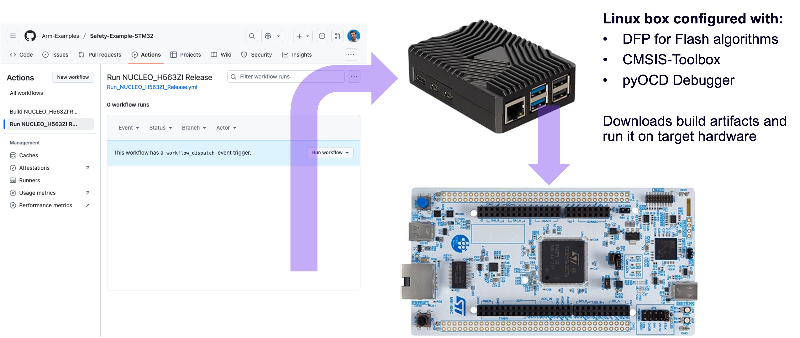

# Self-hosted runner for execution test

The CMSIS-Toolbox implements and
[Run and Debug Configuration](https://open-cmsis-pack.github.io/cmsis-toolbox/build-overview/#run-and-debug-configuration)
for command line usage with pyOCD.

This section explains how to setup a Linux machine that runs a GitHub self-hosted runner for programming and execution
of an application. The [build workflow](../.github/workflows/Build_NUCLEO_H563ZI_Release.yaml) is executed on a GitHub
hosted runner that stores the build output as an artifact.



## Prepare a self-hosted runner

These installation instructions are written for a Raspberry Pi (mode 3/4/5) running an Arm64 Ubuntu server edition.

> [!NOTE]
> This has been tested on [Ubuntu Server 24.0.3 LTS](https://ubuntu.com/download/server). For other Linux OS, please
> adapt the steps.

## Prerequisites

Update you local machine with the latest changes.

```sh
# Make sure your system is up-to-date
sudo apt update && sudo apt upgrade

# Install required tools
sudo apt install net-tools zip unzip
```

## pyOCD

pyOCD is a debug connector used in [Keil Studio](https://mdk-packs.github.io/vscode-cmsis-solution-docs/index.html)
that offers also command-line operation for Continuous Integration (CI).

### Install pyOCD

> [!NOTE]
> Ubuntu Server 24.0.3 already comes with Python 3.12.x which is used in the following to describe the set up of
> `pyocd` in a virtual environment. Please make sure to install an appropriate Python version on your system as well.

```sh
# Create a virtual environment
python -m venv ~/pyocd_venv

# Activate the virtual environment
source ~/pyocd_venv/bin/activate

# Install pyocd
pip3 install pyocd
```

## vcpkg

vcpkg is a free C/C++ package manager for acquiring and managing libraries and is used in the CMSIS solution workflow
to download additional tools.

### Install vcpkg

Download the latest `vcpkg` release from the GitHub repository:

```sh
VCPKG=$(curl -s https://api.github.com/repos/microsoft/vcpkg/releases/latest | jq -r '.tarball_url')
curl -o vcpkg.tar.gz -L $VCPKG.tar.gz
```

Create a new directory to store `vcpkg` and extract the tar.gz file to it:

```sh
mkdir .vcpkg
tar xf vcpkg.tar.gz --strip-components=1 -C .vcpkg
```

Run the following command to build vcpkg itself:

```sh
cd .vcpkg/
./bootstrap-vcpkg.sh
```

Configure the `VCPKG_ROOT` environment variable:

```sh
export VCPKG_ROOT=/path/to/vcpkg
export PATH=$VCPKG_ROOT:$PATH
```

> [!NOTE]
> Setting environment variables using the export command only affects the current shell session. To make this change
> permanent across sessions, add the export command to your shell's profile script (e.g., `~/.bashrc`).

The tar.gz file is no longer needed, remove it:

```sh
cd ..
rm -rf vcpkg.tar.gz
```

Check if the installation was successful:

```sh
vcpkg version
```

### Activation

Download the `vcpkg-configuration.json` file that contains the CMSIS-Toolbox:

```sh
curl -o vcpkg-configuration.json -L https://raw.githubusercontent.com/Arm-Examples/Safety-Example-STM32/refs/heads/main/vcpkg-run-configuration.json
```

Then, update the registry:

```sh
vcpkg x-update-registry --all
```

Finally, activate `vcpkg`:

```sh
vcpkg activate --json=env.json
```

> [!NOTE]
> If `node` is not installed on your machine, it will be downloaded automatically.

Get the path to the CMSIS-Toolbox from the generated `env.json` file"

```sh
CMSIS_TOOLBOX=$(jq '.paths.PATH[]' env.json | tr -d '\"')
export PATH=$CMSIS_TOOLBOX:$PATH
```

## Install CMSIS-Packs

Now, you have access to the CMSIS-Toolbox which also contains the `cpackget` tool which is used to download CMSIS-Packs
from the web. For this example, we need the device family and board support packs from Infineon.

```sh
cpackget add -a -F Keil::STM32H5xx_DFP@2.1.0
cpackget add -a -F Keil::NUCLEO-H563ZI_BSP@1.1.0
```

> [!NOTE]
> Run this command again if the pack versions change.

## Install the self-hosted runner

### Download and extract the runner

In your GitHub repository, go to Settings → Actions → Runners and select "New self-hosted runner".

Select the appropriate OS and architecture (here: Linux/ARM64).

Follow the instructions that are given on that page until you start the self-hosted runner.

### Run persistently

In the last step, you have started the runner manually. If you want to start it at boot time, install a `systemd`
service:

```sh
sudo ./svc.sh install
```

Start the service manually:

```sh
sudo ./svc.sh start
```

Check the status of the service:

```sh
sudo ./svc.sh status
```
