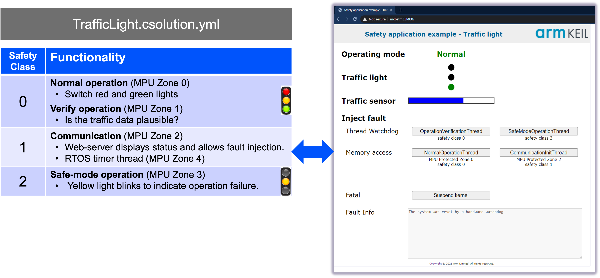

# Safety Example for STMicroelectronics NUCLEO-H563ZI

This repository contains examples for [Keil Studio](https://www.keil.arm.com/) that run on the [STMicroelectronics NUCLEO-H563ZI](https://www.keil.arm.com/boards/stmicroelectronics-nucleo-h563zi-revc-4a2aad3/features/).

## Quick Start

1. Install [Keil Studio for VS Code](https://marketplace.visualstudio.com/items?itemName=Arm.keil-studio-pack) from the
   VS Code marketplace.
2. Clone this Git repository into a VS Code workspace.
3. Open the [CMSIS View](https://mdk-packs.github.io/vscode-cmsis-solution-docs/userinterface.html#2-main-area-of-the-cmsis-view)
   in VS Code and use the ... menu to choose an example via *Select Active Solution from workspace*.
4. The related tools and software packs are downloaded and installed. Review progress with *View - Output - CMSIS Solution*.
5. In the CMSIS view, use the
   [Action buttons](https://github.com/ARM-software/vscode-cmsis-csolution?tab=readme-ov-file#action-buttons) to build,
   load and debug the example on the hardware.

## Examples

The examples can be explored using the [Keil MDK Community edition](https://www.keil.arm.com/keil-mdk/#mdk-v6-editions)
that is free-to-use for training and evaluation. For evaluation purposes, the open-source variant of
[Keil RTX](https://developer.arm.com/Tools%20and%20Software/Keil%20MDK/RTX5%20RTOS) is used which offers the similar
features as the commercial, safety-certified
[FuSa RTS](https://developer.arm.com/Tools%20and%20Software/Keil%20MDK/FuSa%20Run-Time%20System). FuSa RTS is part of
the [Keil MDK Professional edition](https://www.keil.arm.com/keil-mdk/#mdk-v6-editions).

### App

This is a practical demonstration of Arm FuSa RTS process isolation, using a simple traffic light controller to
showcase safety classes, MPU zones, and fault handling on Cortex-M devices.

The [TrafficLight.csolution.yml](./App/TrafficLight.csolution.yml) safety example contains:

- [App/TrafficLight.cproject.yml](./App/TrafficLight.cproject.yml)
  implements the safety-critical application part using functional safety features of Keil RTX.

## Git Workflow

This repository contains multiple *csolution projects* and is configured as a single Git workspace for VS Code. It can be therefore effectively used with the [VS Code Git integration](https://code.visualstudio.com/docs/sourcecontrol/overview) via the following files:

- [vcpkg-configuration.json](./vcpkg-configuration.json) is in the workspace root directory and installs the tools for all *csolution projects*.
- [.gitignore](./.gitignore) excludes files that contain user specific setup, for example `.vscode` and `*.cbuild*.yml`.

## Files and Directories

This is a list of the relevant files and directories.

File/Directory                            | Content
:-----------------------------------------|:---------------------------------------------------------
[vcpkg-configuration.json](./vcpkg-configuration.json) | Defines the tools that the [Arm Tools Environment Manager](https://marketplace.visualstudio.com/items?itemName=Arm.environment-manager) installs in VS Code.
[App](./App) | Contains the safety example.
[.github/workflows](./.github/workflows)  | Contains setup for the CI Build and HiL test workflows.

## Issues or Questions

Use the [**Issues**](./issues) tab to raise questions or issues.
