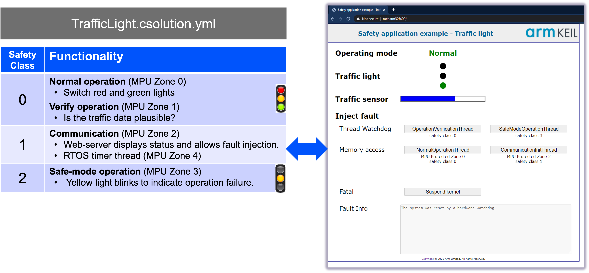

# Safety Example for STMicroelectronics NUCLEO-H563ZI

This repository contains examples for [Keil Studio](https://www.keil.arm.com/) that run on the [STMicroelectronics NUCLEO-H563ZI](https://www.keil.arm.com/boards/stmicroelectronics-nucleo-h563zi-revc-4a2aad3/features/).

## Quick Start

1. Install [Keil Studio for VS Code](https://marketplace.visualstudio.com/items?itemName=Arm.keil-studio-pack) from the
   VS Code marketplace.
2. In VS Code, either clone this Git repository or (if downloaded as ZIP file) open the top-level folder.
3. Open the [CMSIS View](https://mdk-packs.github.io/vscode-cmsis-solution-docs/userinterface.html#2-main-area-of-the-cmsis-view)
   in VS Code and use the ... menu to choose an example via *Select Active Solution from workspace*.
4. The related tools and software packs are downloaded and installed. Review progress with *View - Output - CMSIS Solution*.
5. In the CMSIS view, use the
   [Action buttons](https://github.com/ARM-software/vscode-cmsis-csolution?tab=readme-ov-file#action-buttons) to build,
   load and debug the example on the hardware.

## Examples description

The examples can be explored using the [Keil MDK-Community edition](https://www.keil.arm.com/mdk-community/)
that is free-to-use for training and evaluation. For evaluation purposes, the open-source variant of
[Keil RTX](https://developer.arm.com/Tools%20and%20Software/Keil%20MDK/RTX5%20RTOS) is used which offers the similar
features as the commercial, safety-certified
[FuSa RTS](https://developer.arm.com/Tools%20and%20Software/Keil%20MDK/FuSa%20Run-Time%20System). FuSa RTS is part of
the [Keil MDK Professional edition](https://www.keil.arm.com/keil-mdk/#mdk-v6-editions).

| Example name                              | Description   |
|---                                        |---            |
| [TrafficLight](./App/TrafficLight.csolution.yml)                  | This is a practical demonstration of Arm FuSa RTS process isolation, using a simple traffic light controller to showcase safety classes, MPU zones, and fault handling on Cortex-M devices. It contains the [App/TrafficLight.cproject.yml](./App/TrafficLight.cproject.yml) which implements the safety-critical application part using functional safety features of Keil RTX.  |

## Git Workflow

This repository contains multiple *csolution projects* and is configured as a single Git workspace for VS Code. It can be therefore effectively used with the [VS Code Git integration](https://code.visualstudio.com/docs/sourcecontrol/overview) via the following files:

- [vcpkg-configuration.json](./vcpkg-configuration.json) is in the workspace root directory and installs the tools for all *csolution projects*.
- [.gitignore](./.gitignore) excludes files that contain user specific setup, for example `.vscode` and `*.cbuild*.yml`.

## Continuous Integration (CI)

The underlying build system of [Keil Studio](https://www.keil.arm.com/) uses the [CMSIS-Toolbox](https://open-cmsis-pack.github.io/cmsis-toolbox/) and CMake. [CI](https://en.wikipedia.org/wiki/Continuous_integration) is effectively supported with:

- Tool installation based on a single [`vcpkg-configuration.json`](./vcpkg-configuration.json) file for desktop and CI environments.
- CMSIS solution files (`*.csolution.yml`) that enable seamless builds in CI, for example using GitHub actions.

| CI Workflow    | Description |
|---                                              |--- |
| [Build_NUCLEO_H563ZI_Release](./.github/workflows/Build_NUCLEO_H563ZI_Release.yml) | Builds the example binary on a GitHub hosted runner and saves it together with the debug configuration as an artifact. |
| [Run_NUCLEO_H563ZI_Release](./.github/workflows/Run_NUCLEO_H563ZI_Release.yml) | Downloads the artifact, flashes the application on a target board and starts it. |

## Files and Directories

This is a list of the relevant files and directories.

| File/Directory                          | Content |
|---                                      |--- |
| [vcpkg-configuration.json](./vcpkg-configuration.json) | Lists all tools that are installed with vcpkg. |
| [.github/workflows](./.github/workflows)  | Contains setup for the CI Build and HiL test workflows. |
| [App](./App) | Contains the safety example. |

## Issues or Questions

Use the [**Issues**](https://github.com/Arm-Examples/Safety-Example-STM32/issues) tab to raise questions or issues.
